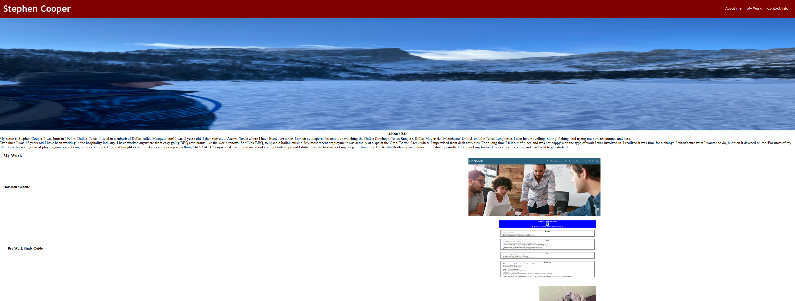

# Stephen,s Portfolio

This is a portfolio of the works that i have created since the start of the class. It includes edits to the Horiseon website where we cleaned up the CSS and added semantic HTML to the code. The other project is the Prework Study Guide that we created before the first day of class. The study guide inlcudes examples and notes of HTML, CSS, and Javascript.

## Usage

To use the funtions of this website, you can navigate to the desired section by clicking one of the nav links at the top of the page. Once at the the disired section, click the image to be directed to the webpage in which you would like to visit. 

https://scoops113.github.io/stephen-cooper-portfolio/

## License

This project is licensed under the MIT License - see the [LICENSE] file for details